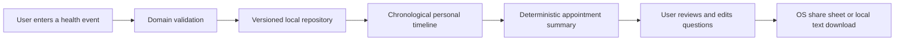

# NutritiScan health-history assistant: design notes

## Product boundary

The first health-history feature stores user-authored facts and helps the user prepare for an appointment. It does not diagnose, prescribe, rank possible diseases, clear a medication as safe, or interpret a lab result. Nutrition entries and public food-label data are kept separate from clinical history.

## Current flow

Each timeline item is explicitly a user-entered record: kind, title, date, optional clinician/facility and a user note. The store currently uses AsyncStorage and is not encrypted by NutritiScan. Version 1 profile/meal data migrates to version 2 with no medical entries. Backup files include versioned profile, meals, recoverable removed meals and health history.

## Future document flow

Do not place a general LLM directly between a file picker and the persistent record store. A later document feature should:

1. Keep the source document in app-private storage, with explicit delete/export behavior and a clear storage-protection choice.
2. Extract text and proposed fields with a document/page/region reference and an extraction confidence. Preserve the original value, units, dates and context.
3. Show proposed fields for user correction. Only user-confirmed values become timeline entries; retain “model extracted, user confirmed” provenance.
4. Build summaries from confirmed entries. If a source is missing, unreadable, ambiguous or contradictory, say so and ask the user instead of guessing.
5. Before using a hosted model, ask separately for consent to send the specific document/data to a named service, explain retention, and provide deletion. Use server-side credentials; never ship a provider key in the app.

## Agent boundary and evaluation

The first model task should be narrow: answer “what have I recorded about X?” and prepare neutral questions for a clinician. Retrieve only the user's selected records. Every factual answer must link to an entry and date; report answers must additionally point to a page/field. The interface labels model-generated wording separately from user-authored facts. The agent must abstain when no cited evidence supports an answer.

Before a model or prompt change ships, evaluate extraction accuracy for value/date/unit, source attribution, missing-field behavior, contradictory sources, OCR noise, regional names/languages, and harmful requests for diagnosis or treatment. Measure incorrect confident answers and missed facts, then require human review of representative cases. A model being available at no license cost does not establish clinical suitability, inference cost, privacy, or regulatory status.

## Operational questions before document AI

- On-device inference versus a hosted private endpoint; expected device floor, latency and operating cost.
- Which source types are in scope first: lab report, prescription, discharge note, or visit note.
- How originals, extracted text and derived summaries are encrypted, backed up, exported and deleted.
- Which jurisdictions and intended uses are supported; obtain appropriate regulatory and privacy review.
- How users report an extraction error and how corrected data supersedes prior extraction.
